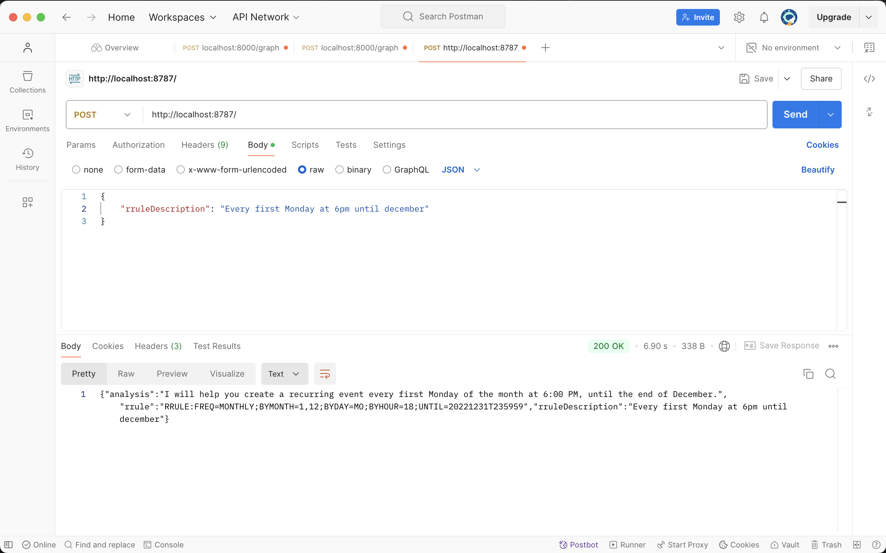

# rrule-generator

Extremely simple wrapper over Gen AI to generate an rrule from a human-written description of a recurring event.

## setup

Create a `.dev.vars` files for locally running, with a value for basic auth, see `index.ts` for `env` variable for the name of that property that must be defined.

## run

`npm start`

then go to Postman and send a payload at the generated URL like so:

the other fields returned are kind of extra for now... You probably only care about the `rrule` field. Have fun!